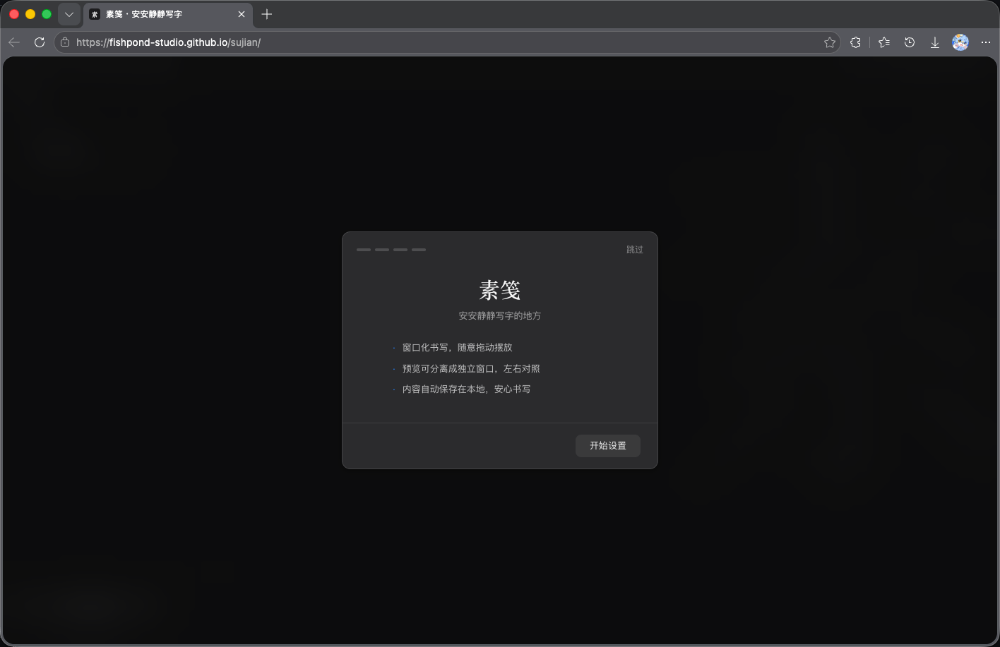
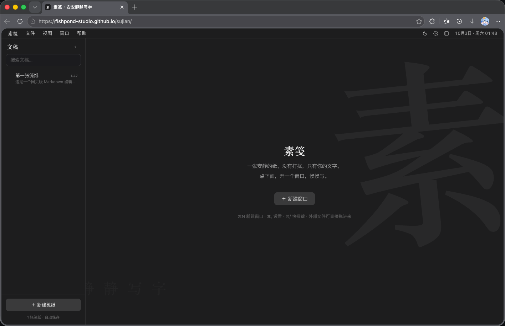
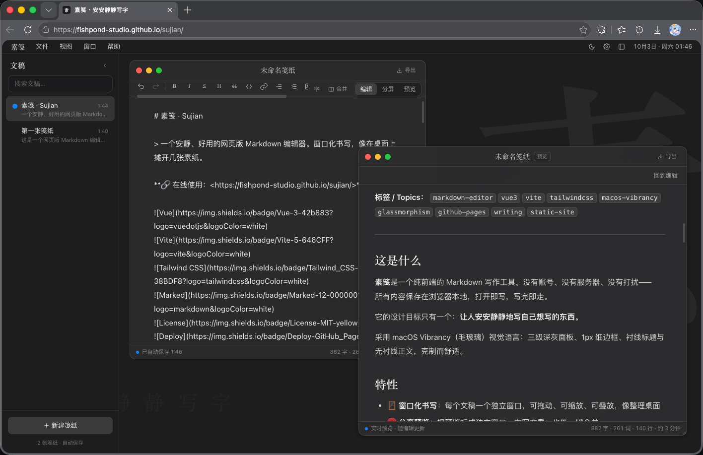

# 素笺 · Sujian

> 一个安静、好用的网页版 Markdown 编辑器。窗口化书写，像在桌面上摊开几张素纸。

**🔗 在线使用：<https://fishpond-studio.github.io/sujian/>**


**标签 / Topics：** `markdown-editor` `vue3` `vite` `tailwindcss` `macos-vibrancy` `glassmorphism` `github-pages` `writing` `static-site`

---

## 界面预览

<p align="center">
  
  
</p>
<p align="center">
  
</p>

---

## 这是什么

**素笺**是一个纯前端的 Markdown 写作工具。没有账号、没有服务器、没有打扰——
所有内容保存在浏览器本地，打开即写，写完即走。

它的设计目标只有一个：**让人安安静静地写自己想写的东西。**

采用 macOS Vibrancy（毛玻璃）视觉语言：三级深灰面板、1px 细边框、衬线标题与无衬线正文，克制而舒适。

## 特性

- 🪟 **窗口化书写**：每个文稿一个独立窗口，可拖动、可缩放、可叠放，像整理桌面
- 🧲 **分离预览**：把预览拆成独立窗口，左写右看；也能一键合并
- 🌗 **深色 / 浅色 / 跟随系统**：三套主题，随时切换
- 🖼️ **可自定义背景**：预设底色、任意颜色、壁纸图片，并支持调节明亮度 / 模糊 / 饱和度 / 暗度
- 📝 **Markdown 扩展**：GFM、单换行、`==高亮==`、上标、下标、Emoji，还支持自定义替换规则
- ↺ **撤回 / 重做**：`⌘Z` / `⇧⌘Z`，打字与格式操作都能撤回
- 🖱️ **右键菜单**：文稿列表、窗口、桌面均可右键，重命名 / 复制 / 分离 / 导入导出 / 删除
- ⌨️ **自定义快捷键**：设置里可重新录制任意快捷键，带冲突检测
- 📂 **多格式导入导出**：导入 `.md .markdown .txt .text .log .csv .json` 等，导出 `md / txt / html`
- 💾 **本地自动保存**：内容与窗口布局自动写入 localStorage，关闭浏览器不丢失
- 🧭 **首次向导**：第一次打开有初始化引导，选择外观、纸张与写作习惯
- 📱 **响应式**：桌面、平板、手机均可用

## 快速开始

```bash
# 安装依赖
npm install

# 本地开发（默认 http://localhost:5173）
npm run dev

# 生产构建，产物在 dist/
npm run build

# 本地预览构建结果
npm run preview
```

## 部署到 GitHub Pages

项目已在 `vite.config.js` 中设置 `base: './'`，可直接部署到任意子路径。

仓库内置了 GitHub Actions 工作流（`.github/workflows/deploy.yml`）：推送到 `main` 后自动构建并发布。

1. 在仓库 **Settings → Pages → Build and deployment** 中把 **Source** 设为 **GitHub Actions**
2. 推送代码到 `main` 分支，等待 Actions 完成
3. 访问 `https://<用户名>.github.io/<仓库名>/`

也可以手动发布：

```bash
npm run build
npx gh-pages -d dist
```

## 快捷键

所有快捷键都可以在 **设置 → 快捷键** 中重新录制。

| 快捷键 | 功能 |
| --- | --- |
| `⌘N` | 新建窗口 |
| `⌘W` / `⇧⌘W` | 关闭当前 / 全部窗口 |
| `⌘M` / `⇧⌘M` | 最小化当前 / 展开全部 |
| `⌘1` / `⌘2` / `⌘3` | 编辑 / 分屏 / 预览模式 |
| `⌥⌘←` / `⌥⌘→` | 切换到上 / 下一个窗口 |
| `⇧⌘D` | 分离预览窗口 |
| `⌘D` | 复制当前文稿 |
| `⌘S` | 立即保存 |
| `⌘E` | 导出当前文稿 |
| `⌘O` | 导入文件 |
| `⇧⌘S` | 显示 / 隐藏侧边栏 |
| `⇧⌘T` | 切换深色 / 浅色 |
| `⌘=` / `⌘-` / `⌘0` | 增大 / 减小 / 重置字号 |
| `⌘Z` / `⇧⌘Z` | 撤回 / 重做 |
| `⌘B` / `⌘I` / `⌘K` | 加粗 / 斜体 / 链接 |
| `⌘,` / `⌘/` | 打开设置 / 快捷键 |

## 技术栈

- [Vue 3](https://vuejs.org/)（Composition API + `<script setup>`）
- [Vite 5](https://vitejs.dev/)
- [Tailwind CSS 3](https://tailwindcss.com/)
- [marked](https://marked.js.org/) + [DOMPurify](https://github.com/cure53/DOMPurify)（Markdown 解析与净化）
- 主题色板基于 CSS 变量，支持深/浅两套 macOS Vibrancy 三级灰阶

## 目录结构

```
.
├─ index.html
├─ vite.config.js
├─ tailwind.config.js
├─ postcss.config.js
└─ src
   ├─ main.js
   ├─ App.vue                # 布局、壁纸、全局快捷键、拖拽导入
   ├─ store.js               # 全局状态、持久化、窗口管理、导入导出
   ├─ style.css              # 主题变量、编辑器与预览样式
   ├─ components
   │  ├─ MenuBar.vue         # 顶部菜单栏与状态栏时钟
   │  ├─ Sidebar.vue         # 文稿列表（重命名 / 右键菜单）
   │  ├─ EditorWindow.vue    # 窗口：拖动缩放、编辑/分屏/预览、撤回重做
   │  ├─ ContextMenu.vue     # 通用右键菜单
   │  ├─ SettingsDialog.vue  # 偏好设置（外观/写作/Markdown/文件/快捷键）
   │  ├─ OnboardingDialog.vue# 首次使用向导
   │  └─ HelpDialog.vue      # 使用入门
   └─ utils
      ├─ markdown.js         # Markdown 渲染与扩展
      ├─ shortcuts.js        # 快捷键注册表与自定义绑定
      └─ contextMenus.js     # 各类右键菜单定义
```

## 数据与隐私

素笺不收集任何数据、不连接任何后端。所有文稿、设置与窗口布局都只保存在你当前浏览器的
`localStorage` 中。清除浏览器数据会同时清除文稿，请用 **设置 → 文件 → 导出全部数据** 做好备份。

## 许可

[MIT](./LICENSE) © 2026 Fishpond Studio
